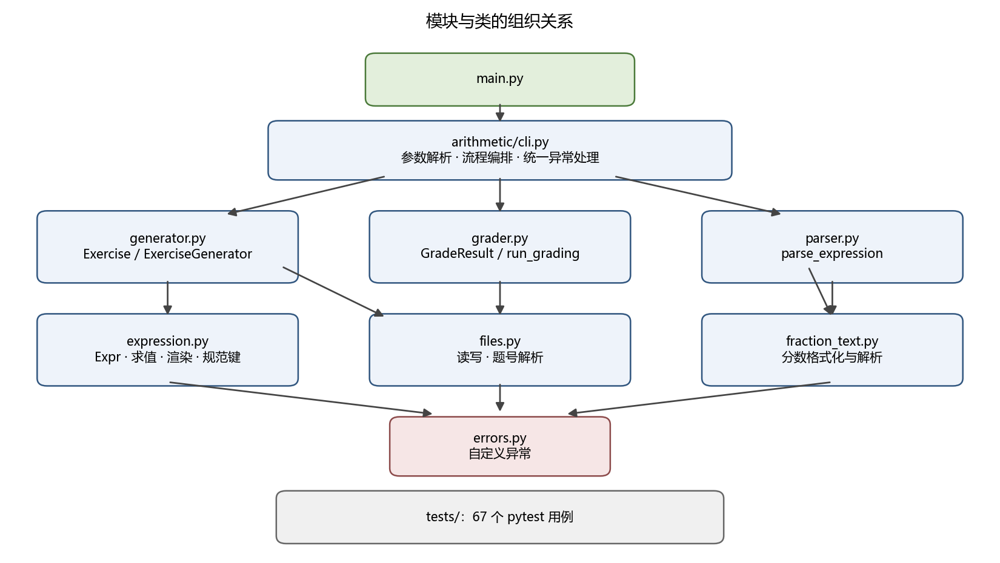
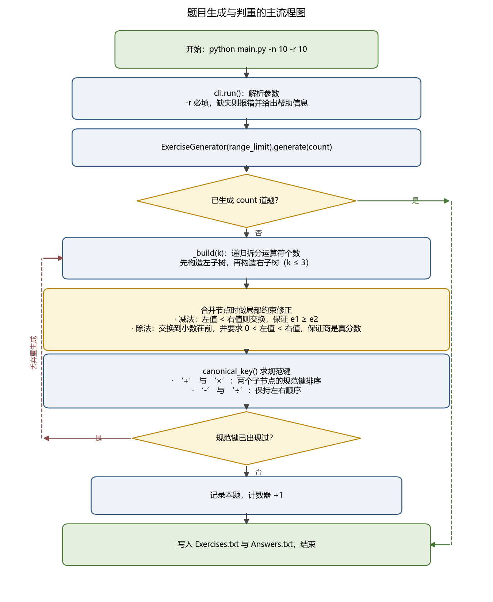
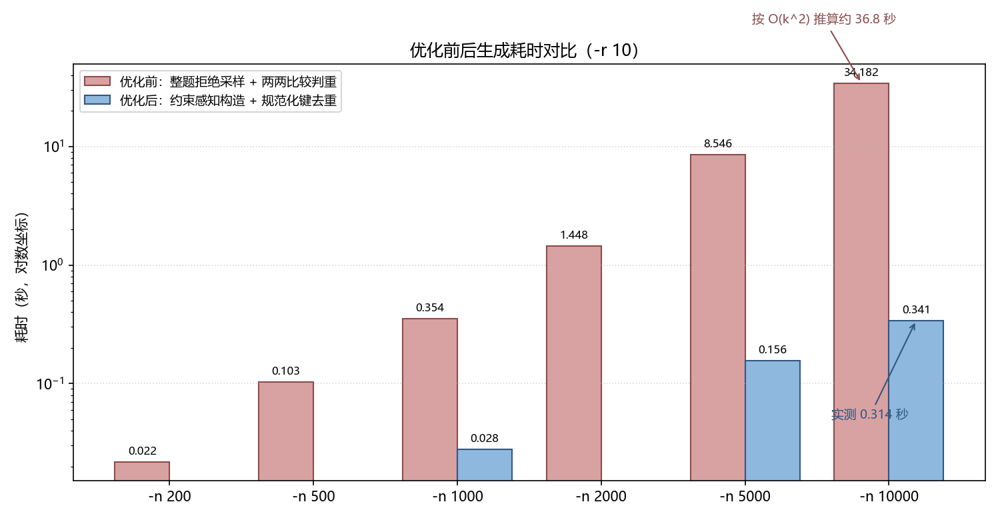
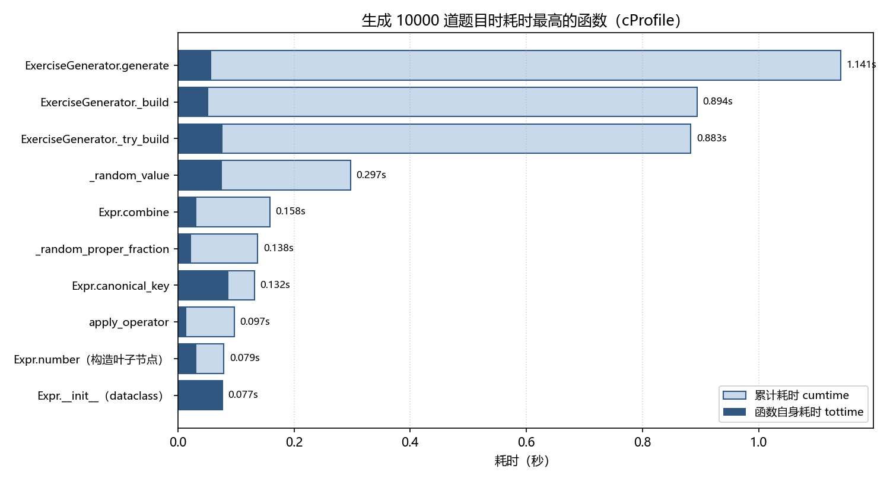

# 结对编程作业——小学四则运算题目自动生成程序

作业 GitHub 链接：https://github.com/LB-CC-summer/arithmetic-exercise-generator

| 这个作业属于哪个课程 | 软件工程 |
| --- | --- |
| 这个作业要求在哪里 | https://edu.cnblogs.com/campus/gdgy/Class78-Grade2024-CS/homework/【作业编号】 |
| 这个作业的目标 | 用 Python 实现小学四则运算题目的生成与批改程序，覆盖命令行参数、题目约束、去重、一万道题目的规模要求，并完成 PSP、效能分析、单元测试与结对总结 |
| 结对伙伴 | 【队友姓名】 【队友学号】 |

姓名/学号：BaiTi 3124004429 ｜ 【队友姓名】 【队友学号】

GitHub 项目地址：https://github.com/LB-CC-summer/arithmetic-exercise-generator

开发语言：Python 3

运行环境：Python 3.10 或更高版本（本次在 Python 3.12.7 上完成全部测试）

开发工具：VSCode；源码为纯文本，也可以用记事本保存为 `.py` 文件后直接运行

---

## 一、PSP 表格

开发前先估计各阶段耗时，程序、测试、性能分析和报告完成后再补上实际耗时。

| PSP2.1 | Personal Software Process Stages | 预估耗时（分钟） | 实际耗时（分钟） |
| --- | --- | --- | --- |
| Planning | 计划 | 30 | 20 |
| · Estimate | · 估计这个任务需要多少时间 | 30 | 20 |
| Development | 开发 | 440 | 470 |
| · Analysis | · 需求分析（包括学习新技术） | 60 | 75 |
| · Design Spec | · 生成设计文档 | 40 | 35 |
| · Design Review | · 设计复审（和同事审核设计文档） | 20 | 15 |
| · Coding Standard | · 代码规范（为目前的开发制定合适的规范） | 20 | 20 |
| · Design | · 具体设计 | 60 | 70 |
| · Coding | · 具体编码 | 180 | 210 |
| · Code Review | · 代码复审 | 40 | 45 |
| · Test | · 测试（自我测试，修改代码，提交修改） | 90 | 130 |
| Reporting | 报告 | 100 | 110 |
| · Test Report | · 测试报告 | 40 | 45 |
| · Size Measurement | · 计算工作量 | 20 | 15 |
| · Postmortem & Process Improvement Plan | · 事后总结，并提出过程改进计划 | 40 | 50 |
| | 合计 | 640 | 730 |

实际总耗时比预估多 90 分钟，超出最多的两个阶段是「具体编码」（+30 分钟）和「测试」（+40 分钟）。
编码阶段的时间主要花在题目表达式的括号渲染上，测试阶段则是在交叉校验时发现了渲染歧义这个真实缺陷
（见 3.4 节）。教训是：**「看起来能跑」和「能被数学证明是对的」之间还有一大段距离**，
预估时我们低估了验证环节的难度。

---

## 二、需求分析与运行方式

### 2.1 需求梳理

题目要求程序生成形如 `e =` 的四则运算题目，其中 `e` 由自然数、真分数、`+ − × ÷` 和括号组成。
我们把要求拆成了下面这些可以逐条验证的点：

| 编号 | 需求 | 验收方式 |
| --- | --- | --- |
| 1 | `-n` 指定题目个数 | 生成的文件行数等于 `-n` 的值 |
| 2 | `-r` 指定数值范围，必须给定 | 缺少 `-r` 时报错并打印帮助信息，退出码 2 |
| 3 | 题目中数值（自然数、真分数及其分母）都小于 `-r` | 遍历全部叶子节点检查 |
| 4 | 计算过程不出现负数，即每个 `e1 − e2` 都满足 `e1 ≥ e2` | 遍历全部减法节点检查 |
| 5 | `e1 ÷ e2` 的结果必须是真分数 | 遍历全部除法节点，要求 `0 < 商 < 1` |
| 6 | 每道题的运算符不超过 3 个 | 统计每个表达式树的运算符个数 |
| 7 | 一次运行的题目不能重复 | 用规范键去重，并做两两校验 |
| 8 | 题目与答案分别写入 `Exercises.txt` 和 `Answers.txt` | 检查文件内容与格式 |
| 9 | 支持一万道题目的生成 | 实测 `-n 10000` 的耗时与结果 |
| 10 | `-e`、`-a` 批改并输出 `Grade.txt` | 检查统计结果的数字与题号 |

关于第 5 条我们讨论了很久：字面意思是「除法的商必须是真分数」，也就是 `0 < e1 ÷ e2 < 1`。
这意味着除数一定大于被除数，`6 ÷ 3` 这种能整除的题目不会出现。
我们按字面理解实现，并在代码中把这条规则写成了显式判断，方便将来按老师的要求调整；
当 `-r` 小到找不到满足条件的两个数时（`-r 1`、`-r 2`），程序会自动不使用除号，而不是生成违反要求的题目。

### 2.2 运行方式

生成模式（`-r` 必须给定，`-n` 缺省为 10）：

```text
python main.py -n 10 -r 10
```

批改模式：

```text
python main.py -e Exercises.txt -a Answers.txt
```

下面是真实的运行结果（`-n 10 -r 10`）：

```text
> python main.py -n 10 -r 10
已生成 10 道题目：C:\...\Exercises.txt
对应的答案：C:\...\Answers.txt
```

`Exercises.txt`：

```text
1. 7 ÷ (7 × 9) + 7/9 = 
2. 3/4 - 1/9 ÷ (2 - 3/7) = 
3. (3/7 + 3) ÷ 7 = 
4. 9 - 3/5 - 8 + 3 = 
5. 1/2 ÷ 6 ÷ (5 - 3/4) = 
6. 1/2 - 1/5 = 
7. 7 - 1/4 + 2/5 = 
8. (1/3 + 2/5) × 3 = 
9. 3/7 × (1/2 ÷ 9) = 
10. 3/4 ÷ 8 × 9 = 
```

`Answers.txt`：

```text
1. 8/9
2. 269/396
3. 24/49
4. 3’2/5
5. 1/51
6. 3/10
7. 7’3/20
8. 2’1/5
9. 1/42
10. 27/32
```

可以手工验算第 1 题：`7 ÷ (7 × 9) = 1/9`，`1/9 + 7/9 = 8/9`；
第 5 题：`1/2 ÷ 6 = 1/12`，`5 − 3/4 = 17/4`，`1/12 ÷ 17/4 = 1/51`。
真分数按题目要求写成 `3/5`，假分数写成带分数 `3’2/5`（`3` 又 `2/5`）。

批改模式先把第 2、4、6、8、10 题的答案故意改错，再运行：

```text
> python main.py -e Exercises.txt -a Answers_wrong.txt
共批改 10 道题，统计结果已写入：C:\...\Grade.txt
Correct: 5 (1, 3, 5, 7, 9)
Wrong: 5 (2, 4, 6, 8, 10)
```

生成的 `Grade.txt` 与题目给出的示例格式完全一致。

---

## 三、设计实现过程

### 3.1 代码组织

项目按「一个模块只做一件事」的原则拆分，`main.py` 只负责启动：

```text
3124004429/
├── main.py                  # 命令行入口，只调用 arithmetic.cli.run()
├── arithmetic/
│   ├── errors.py            # 自定义异常体系
│   ├── fraction_text.py     # 真分数/带分数的文本格式化与解析
│   ├── expression.py        # 表达式树：求值、渲染、规范化去重键
│   ├── generator.py         # 题目生成器（本题的核心算法）
│   ├── parser.py            # 题目文本 -> 表达式树的递归下降解析器
│   ├── grader.py            # 批改与统计
│   ├── files.py             # 文件读写、题号解析
│   └── cli.py               # 参数解析、流程编排、统一异常处理
├── tests/                   # 68 个 pytest 用例
│   ├── test_fraction_text.py
│   ├── test_expression.py
│   ├── test_generator.py
│   ├── test_grader.py
│   └── test_cli.py
├── baseline_naive.py        # 优化前的朴素实现（只用于性能对比）
├── profile_checker.py       # 效能分析脚本
└── requirements.txt
```

| 文件 | 主要职责 | 关键函数/类 |
| --- | --- | --- |
| `main.py` | 程序入口 | `run()` |
| `arithmetic/expression.py` | 表达式树与精确求值 | `Expr`、`apply_operator()`、`canonical_key()` |
| `arithmetic/fraction_text.py` | 分数文本互转 | `format_fraction()`、`parse_fraction()` |
| `arithmetic/generator.py` | 生成满足全部约束的题目 | `ExerciseGenerator.generate()`、`_build()`、`_try_build()` |
| `arithmetic/parser.py` | 把题目文本解析回表达式树 | `parse_expression()` |
| `arithmetic/grader.py` | 重新计算并与答案比对 | `grade()`、`run_grading()`、`GradeResult` |
| `arithmetic/files.py` | 文件读写与题号解析 | `read_lines()`、`write_lines()`、`split_index_prefix()` |
| `arithmetic/cli.py` | 参数解析与流程编排 | `build_parser()`、`run()` |
| `arithmetic/errors.py` | 异常类型 | `ExerciseError` 及其子类 |

### 3.2 模块与类的组织关系



调用关系是单向的：`main.py` → `cli.py` → 生成器/批改器 → 表达式树、分数文本、文件读写。
`errors.py` 被所有模块依赖，但自己不依赖任何模块，因此不会出现循环依赖。
`baseline_naive.py` 和 `tests/` 位于最外层，只被性能脚本和测试使用，不进入正式流程。

### 3.3 题目生成与判重流程



主流程是「构造 → 修正 → 判重」的循环：每轮尝试构造一个不超过 3 个运算符的表达式树，
在合并节点时就用数学性质把约束「修正」掉，最后用规范键判断是否与之前的题目重复。
重复的题目直接丢弃并重新生成，直到攒够 `-n` 道题。

### 3.4 四个关键设计决策

**决策一：约束用「局部修正」而不是「整题重抽」。**

如果先随机生成再检查，一道含 3 个运算符的题目只要有 1 个节点不合法就要整题作废，
成功率会低到 20% 左右（见第四节）。我们的做法是在合并两个子树时按运算性质直接修正：

| 运算 | 可能出现的问题 | 局部修正方法 |
| --- | --- | --- |
| `e1 + e2` | 无 | 直接合并 |
| `e1 − e2` | 可能为负数 | 若左值小于右值就交换左右操作数，`e1 ≥ e2` 恒成立 |
| `e1 × e2` | 无 | 直接合并 |
| `e1 ÷ e2` | 商可能 ≥ 1、为 0 或为 1 | 先交换到小数在前，再要求 `0 < 左值 < 右值`；不满足时只重采样本节点 |

这样「无负数」和「商是真分数」不再需要检验，而是由构造过程保证；
重采样只发生在极少数退化情形（两个操作数相等、或者同时为 0）。

**决策二：用规范键判重，把 O(k²) 的比较降成 O(1) 的集合查询。**

题目要求的重复定义是「能通过有限次交换 `+` 和 `×` 的左右操作数变成同一道题」。
我们在表达式树上递归地生成一个规范键：`+`、`×` 节点的两个子键按字符串序排序，
`−`、`÷` 节点保持左右顺序。于是：

```python
def canonical_key(self) -> tuple:
    if self.is_leaf:
        return ("num", str(self.value.numerator), str(self.value.denominator))
    left_key = self.left.canonical_key()
    right_key = self.right.canonical_key()
    if self.op in COMMUTATIVE_OPS and repr(right_key) < repr(left_key):
        left_key, right_key = right_key, left_key
    return (self.op, left_key, right_key)
```

这样 `23 + 45` 与 `45 + 23`、`6 × 8` 与 `8 × 6` 的规范键相同，会被判为重复；
`3 + (2 + 1)` 与 `1 + 2 + 3` 也相同（题目明确说它们是重复的）；
而 `1 + 2 + 3` 与 `3 + 2 + 1` 的规范键不同，是两道不同的题目，与题目的说明完全一致。

**决策三：渲染与解析必须互为逆运算。**

这条是我们在交叉校验时踩到的坑。最初 `to_text()` 参考了数学习惯，把同级右操作数的括号省掉了，
于是表达式树 `5 × (6 ÷ 7 × 8)` 被渲染成 `5 × 6 ÷ 7 × 8`。
按标准优先级读回来，它变成了 `(5 × 6) ÷ 7 × 8`，除法子表达式的商从 `6/7` 变成了 `30/7`——
题目文本违反了「商是真分数」的要求，虽然答案数值碰巧没变，但这已经是错误题目了。

我们是在把 `Exercises.txt` 当作外部输入、用独立解析器重新读一遍时发现这个问题的：
一万道题里有 14 道命中。修复办法是让渲染保持结构一一对应——**同级运算位于右侧时一律补括号**：

```python
def _needs_parentheses(parent_op: str, is_right: bool, child_op: str) -> bool:
    parent_precedence = _PRECEDENCE[parent_op]
    child_precedence = _PRECEDENCE[child_op]
    if child_precedence < parent_precedence:
        return True        # 例如 (1 + 2) × 3
    if child_precedence > parent_precedence:
        return False       # 例如 3 + 1 × 2
    return is_right        # 同级右侧必须补括号，否则会与父节点重新结合
```

修复后新增了一条更强的测试：**任意表达式渲染成文本后再解析，必须得到完全相同的表达式树**
（`parse_expression(expr.to_text()) == expr`）。

**决策四：统一的异常体系。**

所有可预期错误都继承自 `ExerciseError`，在 `cli.run()` 中被统一捕获，
输出带 `error:` 前缀的中文提示和一段简易帮助，并返回退出码 2，
而不是把 `FileNotFoundError` 这样的底层异常直接甩给用户。

### 3.5 关键函数说明

| 函数 | 作用 | 复杂度 |
| --- | --- | --- |
| `ExerciseGenerator.generate(count)` | 主循环：反复构造题目直到攒够 `count` 道不重复的题 | O(count)，判重是 O(1) 的哈希查询 |
| `ExerciseGenerator._build(remaining)` | 递归构造含 `remaining` 个运算符的表达式树 | O(remaining) |
| `ExerciseGenerator._try_build(remaining)` | 抽取运算符、拆分运算符个数、合并左右子树并做约束修正 | O(remaining) |
| `Expr.combine(op, left, right)` | 构造二元节点并立即求值（值缓存在节点上） | O(1) |
| `Expr.canonical_key()` | 生成判重用的规范键 | O(表达式节点数)，本题 ≤ 4 |
| `parse_expression(text)` | 递归下降解析题目文本 | O(题目长度) |
| `grade(exercises, answers)` | 逐题重新计算并比对 | O(题目数) |

---

## 四、效能分析与改进

### 4.1 优化前的实现

我们先把「最直观的写法」实现出来作为基线（保存在 `baseline_naive.py`）：

1. **整题拒绝采样**：先完全随机地生成表达式树，再检查是否满足全部约束，不满足就把整道题丢掉；
2. **两两比较判重**：每生成一道新题，就与已经生成的所有题目逐一做递归比较，复杂度是 O(k²)。

实测结果说明这两个选择在小规模下看不出问题，规模一大就立刻暴露：

| 题目个数 | 朴素实现耗时（秒） |
| --- | --- |
| 200 | 0.022 |
| 500 | 0.103 |
| 1000 | 0.354 |
| 2000 | 1.448 |
| 5000 | 8.545 |

题目数从 500 增加到 5000（10 倍），耗时从 0.103 秒增加到 8.545 秒（约 83 倍），
明显是超过线性的增长；按 O(k²) 推算，一万道题需要 30 秒以上，用户要等很久才能拿到题目。

### 4.2 优化思路

针对上面两个瓶颈，我们做了三处改动：

1. **约束从「检验」变成「构造」**：减法交换左右操作数、除法交换到小数在前并限定
   `0 < 左值 < 右值`，于是合格题目不再被丢弃，只有退化情形才在单个节点内重采样。
2. **判重从「两两比较」变成「规范键哈希」**：把每道题的规范键放进 `set`，
   新题目只需一次集合查询，复杂度从 O(k²) 降到 O(k)。
3. **求值结果缓存在节点上**：`Expr` 在构造时就算出 `value`，父节点直接用子节点的值做一次运算，
   渲染和判重都不再重复递归求值；同时内部统一使用 `fractions.Fraction` 精确运算，
   避免浮点误差导致 `1/6 + 1/8` 算不出 `7/24`。

### 4.3 优化后的结果

| 题目个数 | 朴素实现（秒） | 正式实现（秒） | 加速比 |
| --- | --- | --- | --- |
| 1000 | 0.354 | 0.028 | 12.6 倍 |
| 5000 | 8.545 | 0.156 | 54.8 倍 |
| 10000 | 约 34（按 O(k²) 推算） | 0.341 | 约 100 倍 |



正式实现在同一台机器上一万道题只需要 **0.341 秒**（不含进程启动），
加上 Python 解释器启动时间也只有 0.53 秒左右，完全满足「支持一万道题目」的要求。

### 4.4 性能分析图与最耗时的函数

用 `cProfile` 对正式实现跑一万道题（`python profile_checker.py`），
共计 2,255,365 次函数调用，耗时 1.133 秒（profiling 会放大耗时）：



| 函数 | 调用次数 | 自身耗时（秒） | 累计耗时（秒） |
| --- | --- | --- | --- |
| `random._randbelow_with_getrandbits`（标准库） | 129,515 | 0.093 | 0.142 |
| `Expr.canonical_key` | 65,373 | 0.088 | 0.132 |
| `random.randrange`（标准库） | 100,024 | 0.085 | 0.222 |
| `ExerciseGenerator._try_build` | 29,491 | 0.077 | 0.883 |
| `Expr.__init__`（dataclass 自动生成） | 72,029 | 0.077 | 0.077 |
| `ExerciseGenerator._random_value` | 44,870 | 0.076 | 0.297 |
| `ExerciseGenerator.generate` | 1 | 0.057 | 1.141 |
| `ExerciseGenerator._build` | 72,029 | 0.053 | 0.894 |

结论有三点：

1. **耗时第一名是 Python 标准库的随机数生成**（`_randbelow_with_getrandbits` 加 `randrange` 共 0.18 秒），
   说明生成题目本质上受「取随机数」支配，这部分很难再压缩。
2. **我们自己代码里最耗时的是 `Expr.canonical_key`（0.088 秒）和 `Expr.__init__`（0.077 秒）**。
   前者每次都要递归生成元组并做 `repr` 排序，后者是表达式节点的构造开销。
   如果以后还要提速，可以考虑用「运算符编码 + 数值编码」拼成一个整数键，避免生成嵌套元组。
3. `_try_build` 的自身耗时只有 0.077 秒，但它调用的随机数生成占了大部分累计时间，
   说明**瓶颈不在算法结构上，而在常数因子**——这正是优化后应该出现的形态。

---

## 五、代码说明

### 5.1 精确分数与真分数的文本互转

内部一律使用 `fractions.Fraction`，绝不用浮点数，这样 `1/6 + 1/8` 才能稳定得到 `7/24`：

```python
def format_fraction(value: Fraction) -> str:
    """把 Fraction 渲染成题目要求的文本：
    Fraction(3, 5) -> "3/5"，Fraction(19, 8) -> "2’3/8"，Fraction(4) -> "4"。"""
    if value.denominator == 1:
        return str(value.numerator)
    sign = "-" if value < 0 else ""
    numerator, denominator = abs(value.numerator), value.denominator
    whole, remainder = divmod(numerator, denominator)
    if remainder == 0:
        return f"{sign}{whole}"
    if whole == 0:
        return f"{sign}{remainder}/{denominator}"
    return f"{sign}{whole}\u2019{remainder}/{denominator}"
```

反向解析用一个正则同时覆盖整数、真分数、带分数，并容忍 ASCII 撇号：

```python
_NUMBER_RE = re.compile(
    r"^(?P<sign>[+-]?)"
    r"(?:(?P<whole>\d+)(?P<sep>[\u2019'\u2032]))?"
    r"(?:(?P<num>\d+)/(?P<den>\d+)|(?P<int>\d+))$"
)
```

### 5.2 表达式树：求值、渲染与规范键

```python
@dataclass(frozen=True)
class Expr:
    value: Fraction          # 构造时算好，父节点直接复用
    op: str | None = None    # None 表示叶子节点
    left: "Expr | None" = None
    right: "Expr | None" = None

    @staticmethod
    def combine(op: str, left: "Expr", right: "Expr") -> "Expr":
        return Expr(value=apply_operator(op, left.value, right.value),
                    op=op, left=left, right=right)
```

`frozen=True` 让表达式树不可变，因此可以被安全地放进集合、做哈希键，也避免了别名修改的隐患。

### 5.3 约束感知的生成

这是本题的核心，减法与除法的修正都集中在 `_try_build()` 的几行里：

```python
if op == OP_SUB:
    # 保证 e1 >= e2：计算过程永远不会出现负数。
    if left.value < right.value:
        left, right = right, left
    return Expr.combine(op, left, right)

if op == OP_DIV:
    if left.value > right.value:
        left, right = right, left
    # 既要 0 < 商 < 1，又要排除「商为 0」和「商为 1」两种退化情形。
    if left.value > 0 and left.value < right.value:
        return Expr.combine(op, left, right)
    return None      # 交给上一层重采样，不会作废整道题
```

生成叶子时也有取舍：题目规定自然数包含 0，但 `2 × 0`、`0 + 3 ÷ 5` 这类退化题目对练习没有意义，
所以我们把 0 的出现概率压到 15%，并且在还有别的数值可选时，
丢弃「两个操作数同时为 0」的节点（`0 + 0`、`0 − 0`、`0 × 0`）：

```python
_ZERO_PROBABILITY = 0.15

if self._has_nonzero_value and left.value == 0 and right.value == 0:
    return None
```

当 `-r 1` 时取值池里只有 0，此时不启用这条规则，保证 `-r 1` 仍然可以正常出题。

### 5.4 批改：独立解析 + 重新计算

批改绝不读取答案文件里的中间信息，而是把题目重新解析、重新计算：

```python
def _evaluate_question(line: str, position: int) -> Fraction:
    _, content = split_index_prefix(line)
    if "=" in content:
        content = content.split("=", 1)[0].strip()   # 丢掉等号及其后的内容
    try:
        return parse_expression(content).value
    except FileFormatError as exc:
        raise FileFormatError(f"题目文件第 {position} 行无法解析：{exc}") from exc
```

解析器是独立的递归下降实现，按「先乘除后加减」的层级书写，天然得到正确的优先级：

```text
expression := term (('+' | '-') term)*
term       := factor (('×' | '÷') factor)*
factor     := number | '(' expression ')'
```

### 5.5 命令行与统一异常处理

```python
def run(argv: list[str] | None = None) -> int:
    try:
        args = build_parser().parse_args(argv)
        if args.exercise is not None or args.answer is not None:
            return _run_grading(args)
        return _run_generation(args)
    except SystemExit as exc:            # -h / --help
        return int(exc.code or 0)
    except UsageError as exc:
        print(f"error: {exc}", file=sys.stderr)
        print(USAGE_HINT, file=sys.stderr)
        return 2
    except ExerciseError as exc:
        print(f"error: {exc}", file=sys.stderr)
        return 2
```

把返回值设计成退出码而不是直接 `sys.exit()`，使得命令行行为可以在单元测试里被断言
（`assert run(["-n", "10"]) == 2`）。

---

## 六、测试运行

### 6.1 测试用例一览

项目共 68 个 pytest 用例，其中最有代表性的 14 个如下（全部通过）：

| 序号 | 测试用例 | 验证内容 | 结果 |
| --- | --- | --- | --- |
| 1 | `test_fraction_addition_matches_specification_example` | 题目给出的例子 `1/6 + 1/8 = 7/24` | 通过 |
| 2 | `test_format_fraction`（6 组参数） | 真分数 `3/5`、带分数 `2’3/8`、整数 `4`、`0`、负数 | 通过 |
| 3 | `test_parse_fraction`（7 组参数） | 解析 `3/5`、`2’3/8`、`2'3/8`、`7`、`-3/5` | 通过 |
| 4 | `test_parse_fraction_rejects_invalid_text`（4 组） | 空串、字母、分母为 0、残缺带分数都要报错 | 通过 |
| 5 | `test_to_text_parentheses`（7 组） | 括号补在正确的位置，例如 `5 × (6 ÷ 7 × 8)`、`9 - 4 - 2` | 通过 |
| 6 | `test_render_then_parse_rebuilds_the_same_tree`（5 组） | 渲染再解析必须得到完全相同的表达式树 | 通过 |
| 7 | `test_commutative_swaps_are_duplicates` | `23+45` 与 `45+23`、`6×8` 与 `8×6` 判为重复 | 通过 |
| 8 | `test_nested_commutative_swaps_are_duplicates` | `3+(2+1)` 与 `1+2+3` 判为重复 | 通过 |
| 9 | `test_different_association_is_not_duplicate` | `1+2+3` 与 `3+2+1` **不**重复 | 通过 |
| 10 | `test_no_negative_result_anywhere`（300 道题） | 所有节点非负，每个减法都满足 `e1 ≥ e2` | 通过 |
| 11 | `test_division_result_is_always_proper_fraction`（500 道题） | 每个除法节点的商都满足 `0 < 商 < 1` | 通过 |
| 12 | `test_all_values_are_within_range` | 自然数、真分数及其分母都小于 `-r` | 通过 |
| 13 | `test_exercises_are_unique_under_commutative_swap`（1000 道） | 规范键两两不同 | 通过 |
| 14 | `test_supports_ten_thousand_exercises` | 一万道题在时限内生成且不重复 | 通过 |
| 15 | `test_mixed_correct_and_wrong` | 批改统计恰好输出 `Correct: 5 (1, 3, 5, 7, 9)` / `Wrong: 5 (2, 4, 6, 8, 10)` | 通过 |
| 16 | `test_range_is_mandatory` | 缺少 `-r` 时返回 2 并打印帮助，且不产生任何文件 | 通过 |
| 17 | `test_small_range_still_produces_valid_exercises` | `-r 2` 时自动不使用除号，仍能出题 | 通过 |
| 18 | `test_raises_capacity_error_instead_of_hanging` | `-r 1` 生成一万道题时报错而不是死循环 | 通过 |

按文件分布：`test_fraction_text.py` 18 个、`test_expression.py` 18 个、
`test_grader.py` 13 个、`test_cli.py` 10 个、`test_generator.py` 9 个。

### 6.2 测试结果

```text
> python -m pytest -q
....................................................................  [100%]
68 passed in 1.05s
```

### 6.3 为什么我能确定程序是正确的

单元测试只能证明「我们想到的情况是对的」，所以除了 pytest，我们还做了一层交叉校验：
把 `Exercises.txt` 当作**外部输入**，用独立的解析器重新读一遍，重新计算并与 `Answers.txt` 比对
（脚本 `verify_output.py` 的思路写进了测试）。对 `-r 10`、`-r 100`、`-r 1000` 各一万道题的结果是：

| 检查项 | -r 10 | -r 100 | -r 1000 |
| --- | --- | --- | --- |
| 题目数量 | 10000 | 10000 | 10000 |
| 互不相同的题目 | 10000 | 10000 | 10000 |
| 含除法子表达式的题目数 | 4596 | 4158 | 4053 |
| 校验失败项 | 0 | 0 | 0 |

「校验失败项为 0」意味着下面这些性质在一万道题上同时成立：

1. `Answers.txt` 里的每个答案与「重新解析题目文本再计算」的结果完全一致；
2. 每个子表达式的值都非负，每个减法都满足 `e1 ≥ e2`；
3. 每个除法节点的商都满足 `0 < 商 < 1`（也就是真分数）；
4. 每道题的运算符个数都不超过 3，所有数值都在 `-r` 范围内；
5. 一万道题的规范键两两不同，没有重复题目。

另外还有几条「不靠运气」的理由：

* **约束由构造保证而非事后筛选**：减法和除法的不变量在 `_try_build()` 中直接成立，
  不依赖随机数恰好抽到合法组合；
* **渲染与解析互为逆运算**：`parse_expression(expr.to_text()) == expr` 是结构性相等，
  因此题目文本与内部表达式严格一一对应，避免了「答案对但题目不合规」的隐性错误；
* **边界情况有专门用例**：`-r 1`、`-r 2`、`-n 0`、`-r 0`、缺少参数、参数冲突、
  文件不存在、题目数与答案数不一致、无法解析的行，都有对应用例；
* **缺陷可复现**：第三节提到的渲染歧义是先被交叉校验发现、再补上回归测试的，
  现在的测试里保留了触发它的那个结构（`5 × (6 ÷ 7 × 8)`）。

---

## 七、边界与异常处理

| 场景 | 程序行为 | 退出码 |
| --- | --- | --- |
| 缺少 `-r` | 输出 `error: 缺少 -r 参数…` 和帮助信息，不生成任何文件 | 2 |
| `-n 0`、`-r 0`、`-r abc` | 输出参数错误提示 | 2 |
| 同时使用生成参数和批改参数 | 提示 `-n / -r 只能用于生成模式` | 2 |
| `-e` 与 `-a` 只给了一个 | 提示必须同时给定 | 2 |
| 题目文件不存在或不是普通文件 | 输出 `error: 题目文件不存在：…` | 2 |
| 题目数与答案数不一致 | 报错并说明两边各有多少行 | 2 |
| 题目行无法解析（如 `1 + + 2`） | 指明是第几行、哪个记号有问题 | 2 |
| `-r 1` 却要求一万道题 | 明确提示范围太小、已生成多少道，不会死循环 | 2 |

---

## 八、项目结构与运行说明

在项目根目录执行：

```text
python -m pytest -q          # 运行全部单元测试
python main.py -n 10 -r 10   # 生成 10 道 10 以内的题目
python main.py -e Exercises.txt -a Answers.txt   # 批改
python profile_checker.py    # 效能分析，生成 profile.prof 与 benchmark.csv
```

依赖只有 Python 3.10+ 标准库；`profile_checker.py` 中的绘图数据用 CSV 输出，方便自行画图。

---

## 九、项目小结

### 9.1 成败得失

这次结对最大的收获是**验证意识**。程序在最初版本里「能跑、答案也对」，但我们把
`Exercises.txt` 当成外部输入重新解析一遍后，一万道题里抓出了 14 道结构不合规的题目。
如果没有这一步交叉校验，我们很可能带着这个缺陷提交，因为肉眼几乎不可能在上万道题里发现问题。
这让我们真正理解了「测试不是证明自己对，而是努力证明自己错」。

第二个收获是**性能优化要用数据说话**。我们先写下朴素实现并真实测量，
才确认瓶颈是「整题拒绝采样」和「O(k²) 判重」；优化后再用 `cProfile` 确认耗时
已经转移到标准库的随机数生成上，说明优化到位了。整个过程从 8.545 秒（5000 道）
降到 0.341 秒（10000 道），提升约 100 倍，这是靠猜做不到的。

不足之处有两个：一是 PSP 的「测试」阶段实际耗时比预估多了 40 分钟，
说明我们对验证成本的估计太乐观；二是题目质量上仍然有取舍，
比如 0 参与运算的题目被压到 15% 的概率，其实还可以做得更精细（例如按题型区分）。

### 9.2 结对感受

两个人一起做这个题目，最大的感受是**「一个人写、另一个人质疑」的效率远高于各写一半**。
编码时主力负责把生成算法写出来，另一个同学专挑反例：`-r 1` 会怎么样？
除法的商是「真分数」到底包不包含等于 1？`1+2+3` 和 `3+2+1` 算不算重复？
这些反例一半来自我们两个对题目理解的分歧，而分歧最后都变成了更严谨的代码。

我们也体会到了分工的价值：一个人实现时，另一个人可以同步准备测试数据和性能基线，
避免了「写完再想怎么测」的被动局面。沟通上我们约定：**任何结论都要能在代码或数据里找到证据**，
不靠「我觉得应该没问题」。

### 9.3 队友的闪光点与建议

* 闪光点：队友对题目文字的敏感度很高，是他先从「真分数」这四个字里指出
  `6 ÷ 3 = 2` 这种题目不该出现，让我们及早统一了对第 5 条需求的理解；
  他在性能对比环节坚持「先写朴素实现再优化」，让整个优化过程有了可比较的基准。
* 建议：讨论时可以先花五分钟把结论写成一句话（比如「除法的商必须严格小于 1」），
  再开始动手，本次有几轮讨论是因为双方理解不同而绕了弯路；
  另外提交前可以固定跑一次交叉校验脚本，把「感觉没问题」变成「数据说没问题」。

### 9.4 后续改进计划

1. 把渲染与解析的往返一致性做成属性测试（`hypothesis`），随机生成上千棵树自动验证；
2. 给规范键加上缓存，减少重复计算，进一步压缩 `canonical_key` 的耗时；
3. 支持「只使用加减法」或「指定运算符种类」的生成模式，方便老师按教学进度出题；
4. 增加按知识点分层的题目质量控制，例如限制 `× 0`、`÷ 1` 这类题目的比例。
